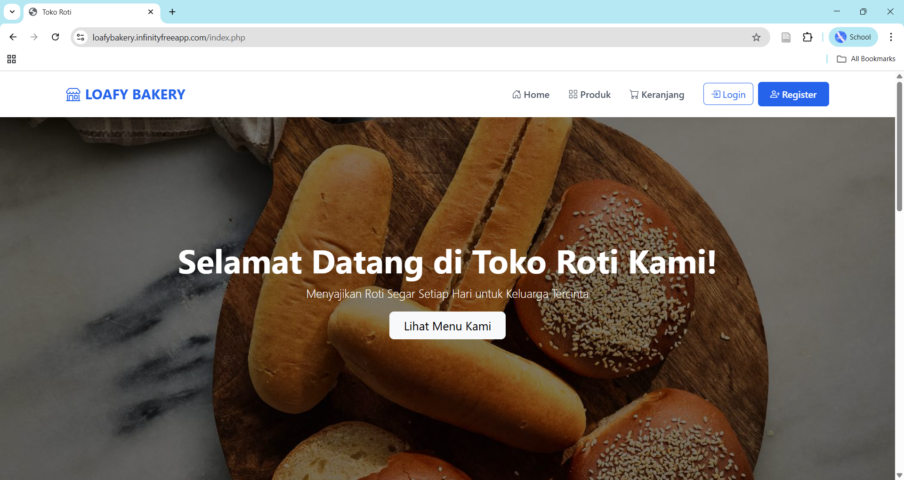

# Loafy Bakery - Sistem Point of Sale Toko Roti Berbasis Web 🍞

Selamat datang di Loafy Bakery, sebuah aplikasi web Point of Sale (POS) dan etalase produk yang dirancang untuk toko roti. Sistem ini memungkinkan pelanggan untuk melihat produk dan melakukan pemesanan, sementara admin dapat mengelola seluruh aspek operasional mulai dari produk hingga verifikasi pesanan.



---

## ✨ Fitur Utama

### Untuk Pelanggan
* [cite_start]**Pendaftaran & Login Pengguna**: Sistem otentikasi yang aman untuk pelanggan. [cite: 227, 351]
* [cite_start]**Galeri Produk**: Menampilkan semua produk roti yang tersedia dengan gambar, nama, dan harga. [cite: 309]
* [cite_start]**Pencarian Produk**: Fitur pencarian untuk memudahkan pelanggan menemukan produk yang diinginkan. [cite: 308]
* [cite_start]**Keranjang Belanja**: Pelanggan dapat menambah [cite: 303][cite_start], mengubah jumlah [cite: 207][cite_start], dan menghapus produk dari keranjang belanja. [cite: 134, 210]
* [cite_start]**Proses Checkout**: Proses checkout yang menghasilkan kode unik untuk verifikasi di kasir. [cite: 69, 345, 348]
* [cite_start]**Riwayat Pesanan**: Pelanggan dapat melihat riwayat pesanan yang sedang berjalan dan yang sudah selesai. [cite: 258, 265]
* [cite_start]**Cetak Struk**: Kemampuan untuk mencetak struk sebagai bukti transaksi. [cite: 43, 275]

### Untuk Admin
* [cite_start]**Dashboard Admin**: Halaman utama untuk admin yang menyediakan akses cepat ke semua fitur manajemen. [cite: 2]
* [cite_start]**Manajemen Produk (CRUD)**: Admin dapat menambah [cite: 3, 377][cite_start], melihat [cite: 80][cite_start], mengedit [cite: 111, 119][cite_start], dan mengarsipkan/memulihkan produk. [cite: 74, 77]
* [cite_start]**Verifikasi Pesanan**: Admin dapat memverifikasi pesanan pelanggan menggunakan kode checkout yang unik. [cite: 4, 396]
* [cite_start]**Manajemen Pesanan**: Melihat daftar semua pesanan yang masuk dari seluruh pelanggan. [cite: 279]

---

## 🛠️ Teknologi yang Digunakan

* [cite_start]**Backend**: PHP [cite: 1]
* [cite_start]**Frontend**: HTML, CSS, JavaScript, Bootstrap 5 [cite: 5, 234, 327]
* [cite_start]**Database**: MySQL [cite: 70, 407]
* **Web Server Lokal**: XAMPP

---

## 🚀 Instalasi & Konfigurasi Lokal

Ikuti langkah-langkah berikut untuk menjalankan proyek ini di komputer lokal Anda:

1.  **Clone Repository**
    ```bash
    git clone [https://github.com/phannstastic/Loafy-Bakery.git](https://github.com/phannstastic/Loafy-Bakery.git)
    cd Loafy-Bakery
    ```

2.  **Setup Web Server**
    * Pastikan Anda sudah menginstall [XAMPP](https://www.apachefriends.org/index.html).
    * Pindahkan folder proyek `Loafy-Bakery` ke dalam direktori `C:\xampp\htdocs\`.

3.  **Buat Database**
    * Buka `phpMyAdmin` (`http://localhost/phpmyadmin`).
    * [cite_start]Buat database baru dengan nama `loafy_bakery`. [cite: 408]

4.  **Impor Database**
    * Pilih database `loafy_bakery` yang baru dibuat.
    * Klik tab `Import`.
    * Pilih file `loafy_bakery.sql` dari folder proyek Anda dan jalankan proses impor.

5.  **Konfigurasi Koneksi**
    * Di dalam folder proyek, buat salinan dari file `config.example.php` (jika ada) dan ubah namanya menjadi `config.php`. Jika tidak ada, buat file baru bernama `config.php`.
    * Buka file `config.php` dan sesuaikan kredensial database dengan pengaturan lokal Anda:
    ```php
    <?php
    $servername = "localhost";
    $username = "root";
    $password = "";
    $dbname = "loafy_bakery";

    $conn = mysqli_connect($servername, $username, $password, $dbname);
    if (!$conn) {
        die("Connection failed: " . mysqli_connect_error());
    }
    ?>
    ```

6.  **Jalankan Aplikasi**
    * Buka browser Anda dan akses `http://localhost/Loafy-Bakery`.

---

## 📂 Struktur Folder
├── assets/         # Aset statis seperti gambar
├── includes/       # Bagian kode yang digunakan berulang (header, footer)
├── admin.php       # Halaman utama admin
├── config.php      # File konfigurasi koneksi (diabaikan oleh .gitignore)
├── index.php       # Halaman utama aplikasi
├── keranjang.php   # Halaman keranjang belanja
├── login.php       # Halaman login
├── produk.php      # Halaman galeri produk
└── loafy_bakery.sql  # File ekspor database

---

Dibuat dengan ❤️ oleh **Tim Mata Kanan**
